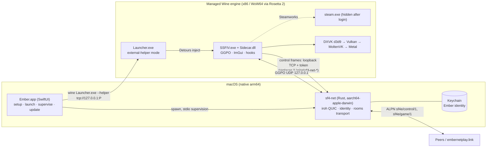
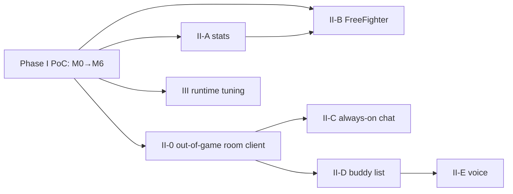

# Ember Netplay on macOS — Phase I plan and Phase II+ roadmap

Status: decisions recorded 2026-10-09 (§7) · Base: `release` @ v1.1.1 · Upstream: [Confetti3/SF4-Ember-Netplay](https://github.com/Confetti3/SF4-Ember-Netplay), itself a fork of [adanducci/sf4e](https://codeberg.org/adanducci/sf4e) (MIT) · Tracking: §10

## 1. The constraint that shapes everything

The thing being ported is not a game. It is a set of patches running *inside* someone else's game.

| Fact | Evidence | Consequence |
| --- | --- | --- |
| USF4 (Steam app 45760) ships Windows-only, 32-bit x86, Direct3D 9 only | Steam appdetails `mac=false`; `Sidecar.dll` is an x86 ImGui DX9/Win32 overlay | No macOS build of the game exists, and we can't recompile it |
| Steamworks DRM | upstream sf4e issue #12 closed wontfix ("Steam required") | The Windows `steam.exe` has to run in the same Wine prefix as the game. Steam emulators are out of scope (legal and ethical) |
| Ember is injected code at fixed RVAs | `src/launcher/launcher.cxx:307` `DetourCreateProcessWithDllsW`; `src/Dimps/Dimps__Game__Battle__System.cxx:24` `BattleUpdate = +0x1d6b10`; pinned to SSFIV build 834219 | Rollback, savestates, input hooks and the room UI all run in the game process as x86 Windows code |
| GGPO runs on the game's main thread | `src/session/IrohMatchSession.cxx:192-198` binds loopback UDP | Rollback can't be moved out of process |

**So "native macOS" has to mean this:** a native Swift app plus a native arm64 networking helper, driving a managed Wine engine that hosts Steam, SSFIV and `Sidecar.dll`. The in-game layer (about 55k LOC across sf4e/Dimps/ui/session/netplay) stays Windows x86 code and runs under Wine permanently. That also keeps every Mac player on the same `Sidecar.dll` build as Windows players, which room lockstep depends on (`SCE_JOIN_REJECTED_HASH_INVALID` → `runtime.build_mismatch`, `src/session/sf4e__SessionClient.cxx:39`; `room::ProtocolVersion = 3`, `src/session/RoomModel.hxx:35`).

Phase I is doable. Upstream Ember already runs under Linux/Proton, and the repo already contains most of the Unix-side groundwork (see §3). The hard parts are in the runtime and in distribution, not in the code.

## 2. Target architecture

What carries over unchanged:

- The wire format: `u32 BE len, u16 ver=1, u64 id, JSON ≤ 512 KiB` (`rust/sf4-net/src/wire.rs:10-15`).
- The ALPNs, so a Mac client interoperates with Windows peers and with the server as-is.
- The GGPO loopback UDP bridge. Wine's Winsock sits on host sockets, so a Windows-side `127.0.0.1` socket reaches a native process. [INFERENCE] This is standard Wine behavior; the M0 spike has to prove it.

## 3. What already exists that we reuse

| Asset | Where | Use on Mac |
| --- | --- | --- |
| Unix `--stdio` mode in sf4-net | `rust/sf4-net/src/main.rs:42-45`, `src/stdio.rs` | Already compiles a non-Windows entry point. A starting point for the native helper |
| POSIX helper client | `src/platform/HelperClientPosix.cxx` (Linux room host + tests) | Reference for a non-pipe transport |
| Wine-aware runtime check | `src/platform/WineBuiltin.hxx:12`, used at `launcher.cxx:476` | VC++ x86 runtime check already accepts Wine builtins |
| Wine identity fallback | `rust/sf4-net/src/identity/platform.rs` (DPAPI refused under Wine → passphrase envelope) | Shows identity storage is already pluggable per platform |
| Wine/DXVK validation harness | `scripts/wine-dxvk/run.sh`, `docs/validation/2026-09-24-wine-dxvk-check.md` | Template for a macOS validation run |
| Transactional updater | `PackageInstaller.cxx`, GitHub asset SHA-256 + `MANIFEST.txt` | Same release assets feed the Mac app's updater |
| Portable locales | `.po` + `locales.json` | Reused for Swift UI strings |
| FreeFighter primitives | `AppInstaller`, `ReleaseAssetResolver`, `ProcessRunner`, `SteamConnectionLog`, VDF parser, `EmberHighball.swift` flow | Proven Swift code for a hidden-Steam + `Launcher.exe` launch flow. Highball itself is GPL-3, so we drive its CLI only and link none of its code |

## 4. Phase I scope — proof of concept

**Success criterion:** gootecks and a few Mac-developer friends (including one long-time 3rd Strike friend) install `Ember.app`, play a session of online matches on Apple Silicon Macs, against each other and against Windows players, and think it's cool. Polish beyond that is Phase II.

**In scope:** Apple Silicon Macs on macOS 26–27; a standalone `Ember.app` that manages **its own pinned Wine engine** (download, prefix, DXVK, Windows Steam, USF4 install/locate); launch, supervision and Ember payload updates; netplay parity with Windows (rooms, public matchmaking, identity, and Discord link where it works); controller support; a signed and notarized DMG.

**Out of scope:** tracking engine updates (the engine stays pinned for the PoC); Intel Macs (untested, may work); recompiling SSFIV; a Metal-native D3D9 path (D3DMetal/DXMT don't do D3D9); replacing the in-game ImGui UI; Steam-less play; all Phase II features.

**Tester prerequisites:** none beyond an Apple Silicon Mac, a Steam account that owns USF4, and Rosetta 2. Highball is not required. gootecks' existing Highball bottle (the 2026-10-08 Mac mini session) serves only as the known-good reference in M0.

## 5. Phase I milestones

Epic: [#1](https://github.com/gootecks/SF4-Ember-Netplay/issues/1) (sub-issues #2–#20, plus #33 upstream offer after the playtest)

Critical path to the playtest: **M0 → M3 → M4 → M6**. That path runs the existing Windows `sf4-net.exe` inside our own Wine prefix, the way it runs under Highball today. M1 + M2 (the native helper) are the "native" track. They run in parallel and join the playtest build only if they're ready and stable. M5 runs alongside M4. Nothing in Phase I waits on upstream.

### M0 — Pin our own engine (gate for everything)

- Inventory the known-good reference: Highball version, engine id (`x64-sikarugir10.0_6-r22` or current), Wine version, DXVK d3d9/MoltenVK versions, and bottle settings (Windows version, DLL overrides, env vars). It already runs USF4 + Ember well on the Mac mini.
- Pick a downloadable engine with the same components: a Gcenx/Sikarugir WoW64 Wine build plus DXVK d3d9 on MoltenVK, from upstream release URLs pinned by SHA-256. Fallback if DXVK d3d9 can't be reproduced: Wine's built-in `wined3d` (OpenGL) for D3D9.
- Build a fresh prefix from a script, with no Highball involved: WoW64, DXVK d3d9, Windows Steam (`SteamSetup.exe`), login, USF4 install, Ember v1.1.1, `Launcher.exe`.
- Measure our prefix against the Highball bottle: steady 60 fps, frame-time variance, input-to-photon delta against the Windows PC on the same display, and shader-compile hitching.
- Prove two connections across the Wine boundary (needed by M1/M2): a native `nc -u` sees GGPO packets from the Wine-side loopback socket, and a native TCP listener accepts a Winsock connect from inside the prefix.
- **Gate:** the scripted prefix plays a 10-game Mac↔Windows set with no desyncs and feels no worse than the Highball bottle. The engine manifest (URLs, SHA-256s, settings) and a baseline report go in `docs/validation/`, with the loopback result recorded either way.

### M1 — Native sf4-net helper (Rust)

- Add the `aarch64-apple-darwin` target. Get `cfg(windows)`-only modules (`ipc.rs`, `identity/platform.rs`) to compile out cleanly on macOS.
- Add a **loopback TCP control transport** next to the named pipe. It listens on `127.0.0.1:0` and authenticates with the existing 42-byte `SF4N`+pid+nonce bootstrap (`ipc.rs:45-49`), which turns into a token handed over out of band. The frame format and `service/protocol.rs` messages stay unchanged.
- Handle lifetime without Windows jobs: the helper exits when the control connection closes. The Swift app owns the process group (it replaces the `JOB_OBJECT_LIMIT_KILL_ON_JOB_CLOSE` semantics at `src/platform/HelperProcess.cxx:61-67`).
- Identity backend: macOS Keychain (`kSecClassGenericPassword`, this-device-only), stored under `~/Library/Application Support/Ember/Identity/v1`. Migration: import an existing passphrase-envelope identity from a Wine prefix (ours or a Highball bottle), so current Mac players keep their `emb1_` Ember ID and tournament history.
- **Gate:** the `cargo test` suite passes on a macOS runner, and the native helper hosts and joins a room against a Windows peer driven by a test harness.

### M2 — Windows-side external-helper mode (C++, ships to everyone)

- `Launcher.exe`: a new `--helper tcp://127.0.0.1:<port>` argument plus the token passed by inherited handle or environment. In this mode it doesn't spawn `sf4-net.exe` and doesn't create the job object.
- `HelperClient`: a TCP transport implementation behind the existing interface. The posix client is the model; Winsock replaces named-pipe I/O. Use the same authentication handshake (`HelperClient.cxx:135`).
- `ember-discord.exe`: Phase I keeps the Windows x64 helper running under Wine. Its stdin bootstrap does `OpenProcess` on the game pid (`src/discord/BridgeServer.hxx:25-29`), which works inside one prefix. [INFERENCE] Discord IPC from inside Wine to the native Discord app needs a bridge. Verify in M0; if it fails, Discord linking is degraded in Phase I and becomes a native Discord Social SDK port in Phase II.
- These are additive changes to the shared build. Windows behavior has to stay byte-identical when `--helper` is absent.
- **Gate:** Windows CI stays green, and a new test covers the TCP transport handshake: rejection on a bad token, oversize frames, and peer close.

### M3 — `EmberKit` engine manager (Swift package)

Build this as a Swift package, not inside the app target, so FreeFighter can consume it unchanged in Phase II (replacing its Highball flow). Reuse the logic in FreeFighter's `EmberHighball.swift` (Steam launch arguments, login wait, `sf4e-<version>` install), `ProcessRunner`, `SteamConnectionLog`, VDF parser and `AppInstaller`/`ReleaseAssetResolver`. Both repos belong to gootecks, so this is a move, not a license question.

- Engine: download the M0-pinned engine (Wine + DXVK d3d9 + MoltenVK), verify SHA-256, extract to `~/Library/Application Support/Ember/Engine/<id>`, clear quarantine, and roll back on failure. There is exactly one pinned engine; no update channel.
- Prefix: create a WoW64 prefix under `~/Library/Application Support/Ember/Prefix` and apply the M0 settings (Windows version, DXVK d3d9 overrides, env vars). Keep them in one engine manifest file, which is where later fighting-game tweaks go.
- Steam: install Windows Steam (`SteamSetup.exe`, SHA-pinned), run a visible first login, then start it hidden (`-silent -no-browser -nofriendsui`). Readiness comes from the connection log, with a 120 s timeout. Install USF4 through Steam (`steam://install/45760`), or add an existing Steam library folder.
- Ember payload: install the release zip (SHA-256 checked against the GitHub asset digest and `MANIFEST.txt`) into `sf4e-<version>` in the prefix, with rollback on failure.
- Game check: verify the SSFIV build is 834219 (the SHA pinned in Sidecar) before launch, and block with a clear message on mismatch.
- Diagnostics: one-click log bundle (Wine, DXVK, Sidecar `spdlog`, sf4-net, app).
- **Gate:** on a clean macOS user account with no Highball, the package goes from nothing to the SSFIV title screen with Ember loaded, and the user logs into Steam exactly once. Swift tests cover the status, error and rollback states, using fake Wine/Steam executables the way `EmberHighballTests` fakes its CLI.

### M4 — `Ember.app` (SwiftUI)

- Setup wizard, a Play button, status (engine, Steam, helper, game), settings, and logs.
- Native `ember://` handling (`CFBundleURLTypes`) that forwards to `Launcher.exe` in the prefix. This replaces the HKCU registration.
- Single-instance and lifecycle: quitting the app tears down the game, Steam (if the app started it) and the helper.
- Controllers: validate a PS5 pad, an Xbox pad, and a common fight stick/Hitbox through Wine's IOHID → DInput/XInput mapping. Document per-device quirks, and add an SDL mapping override only where needed.
- Updates: Ember payload updates go through `EmberKit` from GitHub releases, with the Windows payload (`Launcher.exe`, `Sidecar.dll`, `ember-discord.exe`) always taken from **one tagged release**, so Mac and Windows players stay on the same build. For the PoC, app updates are a new DMG; Sparkle waits for Phase II.
- **Gate:** a non-technical tester goes from DMG to an online match with no terminal use.

### M5 — Build, CI, release

- CI: add a `macos-15` arm64 job that builds `EmberKit` + `Ember.app` and runs the Swift tests. Once M1 lands, it also builds sf4-net for aarch64 and runs the Rust tests. The existing Windows x86 job publishes the Windows payload the Mac job packages.
- Signing: Developer ID, hardened runtime, notarization for the DMG. The engine is downloaded on first run, not bundled, which keeps the DMG small and the notarization surface to our own code.
- Licensing: Wine (LGPL-2.1) and MoltenVK (Apache-2.0) are downloaded unmodified from their upstream release URLs; DXVK is zlib. Third-party notices ship in the app. No Highball code or binaries (GPL-3).
- **Gate:** one tag produces a notarized DMG plus the Windows assets.

### M6 — Playtest (definition of done)

- A smoke matrix before inviting friends: gootecks' Mac mini plus at least one other Apple Silicon Mac; Wi-Fi and wired; one pad and one stick.
- A playtest session with the Mac-dev friends: Mac↔Mac and Mac↔Windows, rooms and public queue, about 20 games total, with no desyncs.
- Collect feedback (setup friction, feel, crashes) in a short report in `docs/validation/`. File the bugs found as Phase I issues, and the wishes as Phase II.

## 6. Risks

| Risk | Likelihood | Impact | Mitigation |
| --- | --- | --- | --- |
| Rosetta 2 narrows after macOS 27 (the gaming subset only) | Certain | High: the Wine engine's x86 path depends on it | Track Apple's gaming-subset definition and validate each macOS beta. Rosetta-independent options are in Phase III |
| Windows Steam client (CEF) breaks under Wine on macOS | Medium | High | Run Steam hidden after login; the Highball bottle stays as a working reference while we tune |
| Our engine underperforms Highball's | Medium | Medium | M0 inventories Highball's engine and gates on parity; `wined3d` is the fallback |
| Upstream engine/DXVK artifact URLs disappear | Low | Medium | Pin by SHA-256 and mirror the exact tarballs in our own GitHub release assets, with a source offer |
| DXVK→MoltenVK hitching or frame pacing hurts rollback feel | Low (already played well on Mac mini) | High | M0 measurement baseline |
| Discord IPC can't reach out of Wine | Medium | Low | Degrade gracefully; native SDK in Phase II |
| SSFIV Steam update moves the RVAs | Low (game is frozen) | High | Already pinned by SHA. Block launch on mismatch |
| Upstream declines the contribution | Medium | Low | Irrelevant to Phase I: we build and playtest on our fork first and only offer the work afterwards. Keep the Windows changes additive so the offer stays easy to accept |

## 7. Decisions (2026-10-09)

1. **Engine: self-managed, pinned, in Phase I.** For the PoC nobody needs engine updates, and if it succeeds we'll be making fighting-game-specific runtime tweaks in-house anyway. Highball is used only as the M0 reference.
2. **Distribution: standalone `Ember.app` first** as the proof of concept. FreeFighter adopts `EmberKit` in Phase II (II-B).
3. **Upstream: build and prove it on our fork first, then offer it.** Phase I depends on no upstream decision. After the M6 playtest, offer the work to the Ember maintainers (who run `embernetplay.link` and appear receptive to PRs), ideally through an introduction from an Ember supporter, with a working demo rather than a proposal. If they decline, the fork stands on its own; Phase I needs no server changes.

### Upstream approach (after M6)

- Lead with evidence: the playtest report, a short gameplay clip of Mac↔Windows matches, and the notarized build.
- Then open a short discussion on Confetti3/SF4-Ember-Netplay linking the M2 design note, because M2 is the only change Windows users would ship.
- Offer small, reviewable PRs: (1) the TCP helper transport in `HelperClient`, (2) the `Launcher.exe` `--helper` flag, (3) the macOS sf4-net target. Each has tests and changes nothing for Windows when unused.
- Follow their conventions: the conventional-commit style seen in their history, and Windows CI passing.

## 8. Phase II+ roadmap

Epic: [#21](https://github.com/gootecks/SF4-Ember-Netplay/issues/21) (sub-issues #22–#28)

Guiding rule: **put feature logic in shared Rust and the server, and only the UI per platform.** Most players are on Windows, so Swift-only social features would split the player base.

### II-0 — Out-of-game room client (foundation for everything below)

Today the room client lives in the DLL (`src/session`, about 13.8k LOC) and only exists while the game runs. Move the room/session client into sf4-net (Rust), and let the DLL become a thin consumer of room state for match flow. Then the native app (and later Windows' launcher UI) can sit in rooms, chat and receive invites without SSFIV running. This is the single biggest Phase II item, and II-B, II-C and II-D depend on it.

### II-A — Local stat tracking

- Source: `NativeMatchResult` (GameManager+0x30, read via `GetNativeResultIndex` at `+0x1d1370`, `src/Dimps/Dimps__Game__Battle.cxx:94`; see `docs/design/NATIVE_MATCH_RESULT.md`) → `MatchResultOutbox`. Fighters and opponent come from the `RoomModel` snapshot (`RoomModel.hxx:165-168,423`).
- Add a `MatchRecorded` helper message (opponent Ember ID + name, both fighters/ultras, result, room/public, ping, rollback stats, timestamps). sf4-net persists it to local SQLite. Today only `onlineRecord` wins/losses survive, in `settings.json`.
- Per-round data (round winner, finish type, time) needs new reverse engineering, using the existing `GetRoundTime` at `+0x1d14d0` as a start.
- UI: a history view in the native app, plus head-to-head records per opponent and matchup charts. Optional export (CSV), and opt-in upload later.

### II-B — FreeFighter integration

Replace `EmberHighball.swift` with `EmberKit` as a `SetupStrategy` (`macApp`/managed engine). Reuse FreeFighter's `AppInstaller`/`ReleaseAssetResolver` for the Ember release assets. Stats from II-A show up in FreeFighter's library view.

### II-C — Always-on chat

Today chat is a room action: 256 B, 1 msg/s, the last 100 kept in memory and lost when the room closes (`src/session/RoomModelActions.cxx:64-66`, `RoomModel.hxx:38-39`). The UI is gated by room state (`src/ui/RoomFeedback.hxx:13-18`).

- Server: persistent channels and DMs in ember-bridge (axum + SQLite), with history, moderation, block lists and rate limits. Authentication uses the existing Ember identity.
- Client: a chat panel in the native app (works with the game closed, via II-0), plus a hotkey toggle for the in-game overlay during matches. Overlay drawing must stay off the rollback-critical path.

### II-D — Buddy list

Server-side friend graph keyed by Ember ID (`emb1_…`), with mutual accept, presence (online / in room / in match), invite-to-room using the existing tickets and `ember://` links, and the notifier pushing invites. Privacy controls ship in the first version: invisible mode and block.

### II-E — Voice chat

Two options to evaluate:

1. **Discord Social SDK voice.** The SDK (1.10.19337) is already integrated for linking. Cheapest, but it requires a Discord account and the SDK's voice terms.
2. **Native voice over the existing iroh peer connection:** a new ALPN, Opus, AVAudioEngine on Mac and WASAPI on Windows. More work, no third party involved.

Either way, voice must never share a congestion budget with GGPO. Use a separate stream/ALPN with priority below game traffic, and a push-to-talk default.

### III — Fighting-game runtime tuning (only if the PoC succeeds)

Epic: [#29](https://github.com/gootecks/SF4-Ember-Netplay/issues/29) (sub-issues #30–#32)

- Tune the in-house engine for fighting games: DXVK frame latency and present mode, MoltenVK settings, Wine sync options, and input polling. Measure each change against the M0 input-to-photon baseline.
- Engine update channel: a deliberate, tested way to roll forward from the pinned engine.
- Rosetta independence: evaluate the x86 emulation options that remain once Rosetta is limited to the gaming subset.

## 9. Next steps

1. Run M0 on the Mac mini: inventory the Highball reference, then script our own pinned engine and prefix.
2. Write the M2 design note in `docs/design/` (for our own build; it doubles as the upstream pitch later).
3. Build `EmberKit` (M3) and then `Ember.app` (M4).

## 10. Tracking

- Repo: <https://github.com/gootecks/SF4-Ember-Netplay> (fork; default branch `release`)
- Project board: [Ember for Mac (#3)](https://github.com/users/gootecks/projects/3), linked to the repo
- Milestones: Phase I — macOS proof of concept (epic #1) · Phase II — Social, stats & FreeFighter (#21) · Phase III — Fighting-game runtime tuning (#29)
- Workflow: issue → `feat/N-description` branch from `release` → PR with `Closes #N` → squash merge. Upstream PRs go to Confetti3/SF4-Ember-Netplay from separate branches.
- Labels: `feat`, `fix`, `chore`, `docs`, `research`, `epic`, `priority:high|medium|low`
